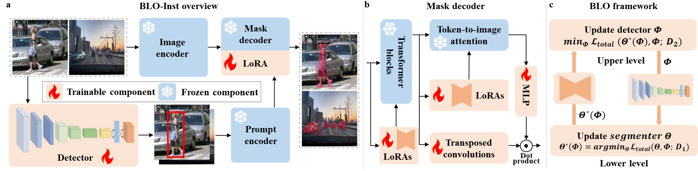

# BLO-Inst
This repository contains the implementation of the following paper:
> **BLO-Inst: Bi-Level Optimization Based Alignment of YOLO and SAM for Robust Instance Segmentation**<br>

## Overview
  
We introduce BLO-Inst, a unified framework that aligns detection and segmentation objectives by bi-level optimization. We formulate the alignment as a nested optimization problem over disjoint data splits. In the lower level, the SAM is fine-tuned to maximize segmentation fidelity given the current detection proposals on a subset. In the upper level, the detector is updated to generate bounding boxes that explicitly minimize the validation loss of the fine-tuned SAM on a separate subset. This effectively transforms the detector into a segmentation-aware prompt generator, optimizing the bounding boxes not just for localization accuracy, but for downstream mask quality.

## Prerequisites
- Linux (We tested our codes on Ubuntu 24.04)
- Anaconda

To get started, first please build the environment
```
conda env create -f environment.yml
```

## Training
You can try our code on one of the public datasets we used in our experiments. Here are the instructions: 

1. We provide the [Penn-Fudan Database](./PennFudanPed/)
2. Pretrain the YOLO model on this dataset. We also provide the [checkpoint](./yolo-pretrained/ped.pt) for your quick try.
2. Change the pretrained weights root setting in [train.sh](train.sh) as `<Your weight path>`.
3. Run this commend to start the training process:
```bash
bash train.sh
```
If everything works, you can find the saved checkpoint in your save folder.


## License
This work is licensed under MIT license. See the [LICENSE](LICENSE) for details.


## Acknowledgement
The code of BLO-Inst is built upon [YOLO](https://github.com/RizwanMunawar/yolov7-segmentation) and [Segment Anything Model](https://github.com/facebookresearch/segment-anything), and we express our gratitude to these awesome projects.
